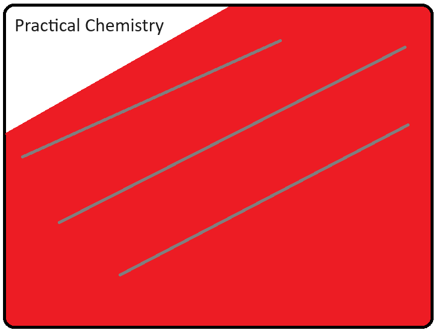

----
# Practical Chemistry
A guide to making money and experimenting as an individual by using chemistry.
------
## Organic Chemistry
### Chemistry of Food
Studying compound foods is more efficient than studying isolated molecules. Akin to lifting weights, it's more efficient to do compound exercises first and then study the isolation exercies.
By doing this, there is reason and intuition to experiment and isolate compounds and molecules.
#### Protein
1. Vegetable Proteins
2. Meat Proteins
   
Or better yet explained

1. Incomplete Proteins
2. Complete Proteins

Figuring out how to get adequate protein intake is important for strength goals
* Slowly increase the intake of protein to body weight or whatever weight you desire
------
#### Carbohydrates
1. Simple Carbohydrates
2. Complex Carbohydrates

Figure out how to get adequate carbohydrate intake is important for cardio goals
* Figure out the proper amount
------
#### Fat
##### Bad Fats
1. Saturated
2. Trans
##### Good Fats
1. Monounsaturated
2. Polyunsaturated 

Food Oils
* Edible oils ie. fish oils
* Cooking oils ie. peanut oils

Figure out how much fat is needed not just for fitness but for brain activity. Fats play a part in mental gymnastics
* Figure out the right amount
------
### Beauty and Body Products
1. Starting with the basics
	* Natural Compounds for facial skin care
		* Got acne?
		* Want smooth skin?
	* Natural compounds for body care ie. sunscreen and lotion
		* Best sun screen for you
		* Get smoother skin?
	* Compounds for nails and dying hair
		* Best polish and paint for nails
		* Best dye for you
2. Working at barbershops, nail salons, beauty parlors, and massage rooms
------
### Whats in your body
------
### Non-Edible Oils
Used for planes, trains, and automobiles
* Lubricants for oils like grease
* Petroleum, fuel and gas => Their cost => Working at a gas station
------
### Painting
* Painting houses, appliances, and metal
* Stripping, priming, and finishing wood
------
### Types of Compostable Trash

-----
## Inorganic Chemistry
------
### Tools in construction and the cost just like Minecraft
* Materials to handle water, dirt, sand, concrete, minerals, and metal
------
### Mechanical things and the most effective solutions for transportation
* Bicycles and their materials
* Cars and their materials
* Being a professional truck driver
------
### 3D Printing and Choosing the best materials for the cost
* Home 3D Printing and 3D programs to create tools
	* Sports Equipment
	* Useful everyday equipments
* Being a CAD/CAM Designer
------
### Maids and janitors
* Bleach
* Disinfectants
* All purpose
* Baking Soda
------
#### Types of Recyclable Trash
------

## Electrochemistry
-----
### Designing Energy Systems Related to Renewable Energy
* Affordable ways to create a simple renewable energy system for Home Depot
	* Solar Panels
		* Parts of solar panels and their ability to collect electricity
	* Batteries
		* Parts of batteries and their ability to store electricity
	* Wires
		* Types of and their ability to handle electricity
------
### Components of a Computer
* Parts of Computer
	* CPU
	* RAM
	* Hard Drive - HDDs and SSDs
	* Motherboards
	* Circuits
	* Fans
------
#### Types of Recyclable Trash

------

## Quantum Chemistry and Physics
### Using 2D programs like javascript to create models for free
* Figure out the distance formula between two points
* Figure out how rotation of an image works
* Figure out how gravity works on a 2D plane
### Using 3D programs like Blender and Unity to create models for free
* Essentially the same as 2D but in 3D

-----

Copyright (c) 2023 Eric Ung

Permission is hereby granted, free of charge, to any person obtaining a copy
of this software and associated documentation files (the "Software"), to deal
in the Software without restriction, including without limitation the rights
to use, copy, modify, merge, publish, distribute, sublicense, and/or sell
copies of the Software, and to permit persons to whom the Software is
furnished to do so, subject to the following conditions:

The above copyright notice and this permission notice shall be included in all
copies or substantial portions of the Software.

THE SOFTWARE IS PROVIDED "AS IS", WITHOUT WARRANTY OF ANY KIND, EXPRESS OR
IMPLIED, INCLUDING BUT NOT LIMITED TO THE WARRANTIES OF MERCHANTABILITY,
FITNESS FOR A PARTICULAR PURPOSE AND NONINFRINGEMENT. IN NO EVENT SHALL THE
AUTHORS OR COPYRIGHT HOLDERS BE LIABLE FOR ANY CLAIM, DAMAGES OR OTHER
LIABILITY, WHETHER IN AN ACTION OF CONTRACT, TORT OR OTHERWISE, ARISING FROM,
OUT OF OR IN CONNECTION WITH THE SOFTWARE OR THE USE OR OTHER DEALINGS IN THE
SOFTWARE.
